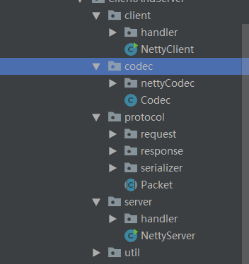
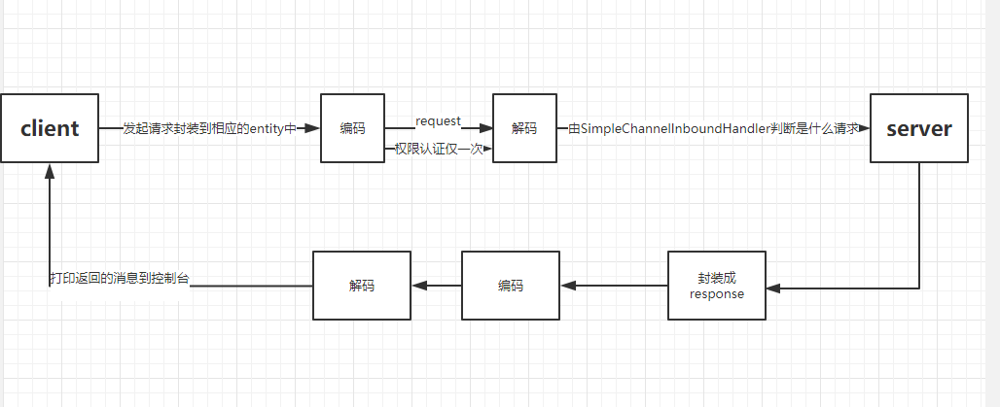

# 介绍

**IM-netty**是一款即时通讯软件，目前有adroid版本（使用mui框架编写的）和web版本（使用Bootstrap+Jquery），**底层通讯使用netty作为通讯工具**，各组件都是使用**springboot**开发完成。后期利用该项目学习**分布式**以及**zookeeper**，把项目**部署到linux服务器**上，使得该项目由单机版本演化为分布式，**目前分布式版本在不断完善中**。

**注：该项目由多个package构成，分别是最开始学习netty搭得脚手架，web单机版本，MUI单机版本，已经现在开发的分布式版本，后文按照倒叙的方式介绍**

## 一·[分布式版本]()（还未部署到Linux）

### 基本流程 
#### 服务端
服务端启动，利用 **@PostConstruct注解** 使得**netty**服务启动，之后立即将自己**ip+oort**注册到**zookeeper**中以供客户端调用调用，之后主要使保存客户端唯一id以及channel以供消息转发，同时**redis**也会缓存相关信息
#### 客户端
客户端启动，完成登陆后产生一个唯一**token**，之后访问任何url都会带有token鉴别身份。之后由客户端发送**消息报文**或者**心跳报文**（自定协议），请求到**路由**转发层（未来这里应该再加一个**消息队列**，可以在高峰时段保证稳定)
#### 中间路由层

**中间路由层**主要涉及各种**接口**以及**转发**，如注册接口，登陆接口，群聊接口，在线用户接口，私聊接口，下线接口等等。
#### 数据库
数据库采用了mysql，缓存采用了redis，关于数据表等结构后文会介绍。

## 二·[MUI框架搭建的anroid端](https://github.com/jiujiujiujiujiuaia/IM-netty/tree/master/src/main/java/com/ycw/wechat)(已经部署到linux)
### 技术选择
- 前端使用mui（不怎么熟悉前端，所以前端就使用了集成度很高框架，使用现成api）
- 后端整合springboot+netty+mybatis
- 利用ajax请求后端接口，将前后端进行分离

### 后端开发

1 **项目package展示**

2 **效果展示**

(1) 登陆注册界面

(2) 个人信息首页

(3) 互相聊天展示

(4) 收到并回复

(5) 好友列表页面

3 **netty构建通讯**

(1)netty服务在springboot上下文启动期间开始，实现ApplicationListener接口，使用饿汉单例模式

(2)前端使用**websocket**通讯，使用**HttpServerCodec**解**http**码，使用**HttpObjectAggregator**，把Http的body和header拼接完整，
然后使用**WebSocketServerProtocolHandler**把**TextWebSocketFrame**传给下一层

(3)使用策略模式和工厂模式把if-else 业务逻辑进行解耦

不同的请求在不同的策略工厂被建造出来，各种策略再去实现相应的handler方法进行解耦

(4)无读写请求时保持心跳，设置keepalive,一旦失去心跳，就回收使其channel失活，节约服务器资源

4 **搜索好友名称使用**

使用**字典树**作为用户名模糊搜索的数据结构

### 前端开发 

(部分日志记录，后面懒了就没有怎么弄了)

12/11 整合完毕，开始登陆注册功能

12/19 完成照片上传下载功能，但是碰到大图就会有明显卡顿，后台做一下处理，图片过大就缩小保存

12/22 完成好友申请添加等等接口，并深入的理解到了mui.plusReady()是在进程初始化的时候执行，比如说
绑定一些事件啊之类，然后初始化完了之后，一直监听直到响应。这也是为什么退出登陆后没有执行mui.plusReady()
函数的原因（初始化一次，除非杀死进程）

12/23 解决高清照片传输加快的问题（如何解决，怎么解决？）

1/18 把MockMultipartFile转换MultipartFile 换成了CommonsMultipartFile转换，原因是MockMultipartFile属于
test依赖中，打包上传到服务器上会出错

1/29 拆分为架构为分布式以及单机，同时把项目改成多模块

## 三·[web端](https://github.com/jiujiujiujiujiuaia/IM-netty/tree/master/src/main/java/com/ycw/wechat)

web端采用B/S（Browser/Server），即浏览器/服务器的结构，主要事务逻辑在服务器端（Server）实现。借鉴MVC模式的思想，
从上至下具体又分为视图层（View）、控制层（Controller）、业务层（Service）、模型层（Model）、数据访问层（Data Access）。

**目前还在把android端的功能迁移到web端，因此web端目前只有通讯功能**

## 四·脚手架demo(学习准备)
### （一）[cs结构](https://github.com/jiujiujiujiujiuaia/IM-netty/tree/master/src/main/java/com/ycw/im/ClientAndServer)

### 项目结构及逻辑

自定义协议
|  魔数（0x12345678）| 序列化算法 |指令  |数据长度  | 数据 |
| --- | --- | --- | --- | --- 
|  4字节| 1字节 | 1字节 | 4字节 | N字节 |  

### 目前完成的功能
- 一对一单聊
- 群聊
- 服务器向所有在线用户推送系统消息（如那个用户登陆成功了，那个用户在线）
### （二）[B/S结构](https://github.com/jiujiujiujiujiuaia/IM-netty/tree/master/src/main/java/com/ycw/im/BrowserAndClient)
- 简单的通过浏览器作客户端向服务器发起请求
- 使用websocket